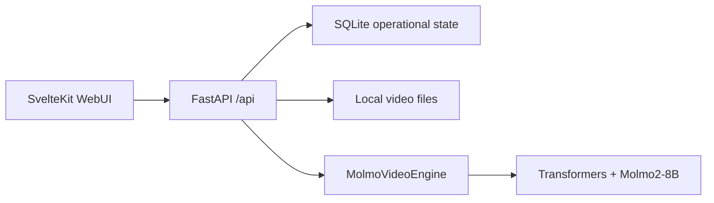

# Architecture

This demo is a local-first short-video QA app built around `allenai/Molmo2-8B`.

## Runtime Boundaries

- `web/` is a SvelteKit + TypeScript app. It owns video selection, upload flow, model status display, and chat-style streamed answers.
- `server/` is a FastAPI app. It owns typed APIs, upload validation, video metadata extraction, SQLite state, and Molmo inference.
- `data/` is runtime state. Uploaded videos live in `data/uploads/`; SQLite state lives in `data/db/`.

## Data Flow

1. The backend registers `test1.mp4` as a sample video at startup when the file is present.
2. The frontend calls `/api/videos`, previews a local `/api/videos/{id}/content` stream, and sends questions to `/api/qa/stream`.
3. The QA route records a run in SQLite, emits SSE status events, serializes inference behind a single lock, and writes the final answer or error.
4. `MolmoVideoEngine` lazy-loads `allenai/Molmo2-8B` through Transformers with `trust_remote_code=True`, `dtype="auto"`, and `device_map="auto"`.

## Storage

SQLite is used for operational state:

- `videos`: file path, metadata, size, source, and creation time.
- `qa_runs`: question, answer, status, timing, model config, and error details.

The app does not upload videos to external services. The only expected network traffic is dependency/model download from package registries and Hugging Face.

## Deployment Shape

Mac is a best-effort local runtime. For reliable native video QA, the same repo can run on a private EC2 GPU host. The EC2 setup script creates the Conda environment, installs Python dependencies, installs Node through nvm using `web/.nvmrc`, and installs frontend dependencies. The planned client demo is screen-share based, so the EC2 app should bind to `127.0.0.1` and be accessed with SSH port forwarding rather than a public URL.

## Next Architecture Step

Long-video QA should add a chunking service behind the same `VideoAnalyzer` interface. The UI and API should continue to ask questions by `video_id`; the analyzer can later decide whether to run one native short-video pass or a chunked retrieval/summarization flow.

## Diagram

